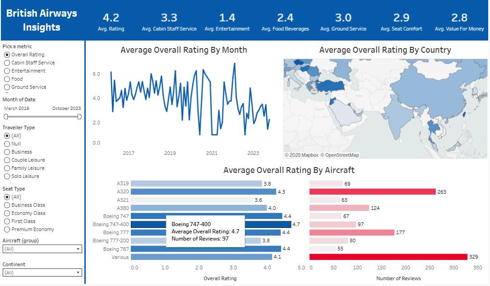

# ✈️ British Airways Insights Dashboard 

## 📝 Project Overview  
This dynamic **Tableau dashboard** provides deep insights into customer reviews and service quality for British Airways across various global locations. The dashboard allows users to select a performance metric (like overall rating, cabin staff service, food, entertainment, etc.) and visualize how it performs across countries, aircraft types, months, and more. 

---

## 💡 Key Insights  
- 🌍 **Location Analysis**: Map view displays average selected metric by country based on user-defined parameters.  
- ✈️ **Aircraft-wise Ratings**: Aircraft comparison chart shows average rating and review count for each aircraft model.  
- 📅 **Seasonal Trends**: Monthly analysis graph shows trends in average ratings across time.  
- 🎛 **Dynamic Filters**: Dashboard is fully interactive with filters for travel type, seat type, aircraft, and continent.  
- 📊 **Header Metrics**: Key KPIs like average rating, staff service, entertainment, and food displayed at the top for quick overview.  

---

## 🛠 Tools & Techniques Used  
- **Tableau Desktop**  
- Dynamic Parameters  
- CASE Statements for Calculated Fields  
- Maps & Geospatial Visualization  
- Bar, Line, and KPI Charts  
- Interactive Filters & Tooltips  
- Data Modeling & Cleaning  

---

## 📷 Dashboard Preview  
  

---

## 📁 Files Included  
- `British Airways Insights.twbx` – Tableau packaged workbook  
- `ba_reviews.csv, Countries.csv` – Cleaned dataset  
- `README.md` – Project documentation  

---

## 📌 How to Use  
1. Open `British Airways Insights.twbx` in **Tableau Desktop**.  
2. Use the **"Pick a Metric"** dropdown to choose KPIs like overall rating, food, staff service, etc.  
3. Interact with filters for **travel type**, **seat type**, **continent**, and **aircraft**.  
4. Explore the **map**, **monthly trends**, and **aircraft breakdown** for deeper analysis.  
5. Refer to the top KPIs for a quick overall summary of performance metrics.
6. For previewing the dashboard, review this: [Tableau Public link](https://public.tableau.com/views/BritishAirwaysInsights_17458817574550/Dashboard1?:language=en-GB&:sid=&:redirect=auth&:display_count=n&:origin=viz_share_link).
  
---

## 🧠 Features Summary  
- 🗺 **Geo-Map**: Country-wise averages for selected metric  
- 📆 **Monthly Graph**: Visual trend by selected KPI over time  
- 🛫 **Aircraft Comparison**: Avg rating & review count per aircraft  
- 🎛 **Fully Interactive**: Multiple filters enable custom exploration  
- 🔢 **CASE Logic**: Metrics driven by calculated fields using CASE statements

---

## 📬 Contact  
Feel free to connect with me on [LinkedIn](https://www.linkedin.com/in/maheen-khalid-38a0591b0/).

